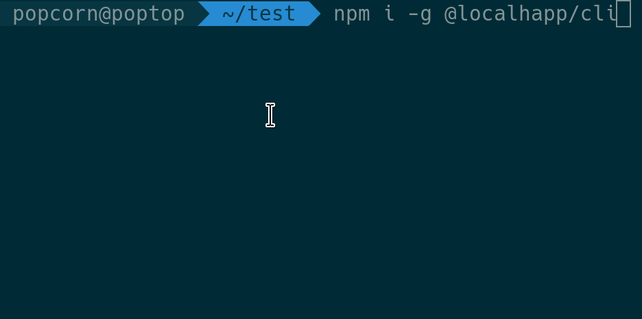

# Cli

You can dowload / update your certs with the command line
```npm i @localhapp/cli```



# Gui
A webpage where you can proxy *.localh.app to your localhost or other adresses.
There is also a small api available.