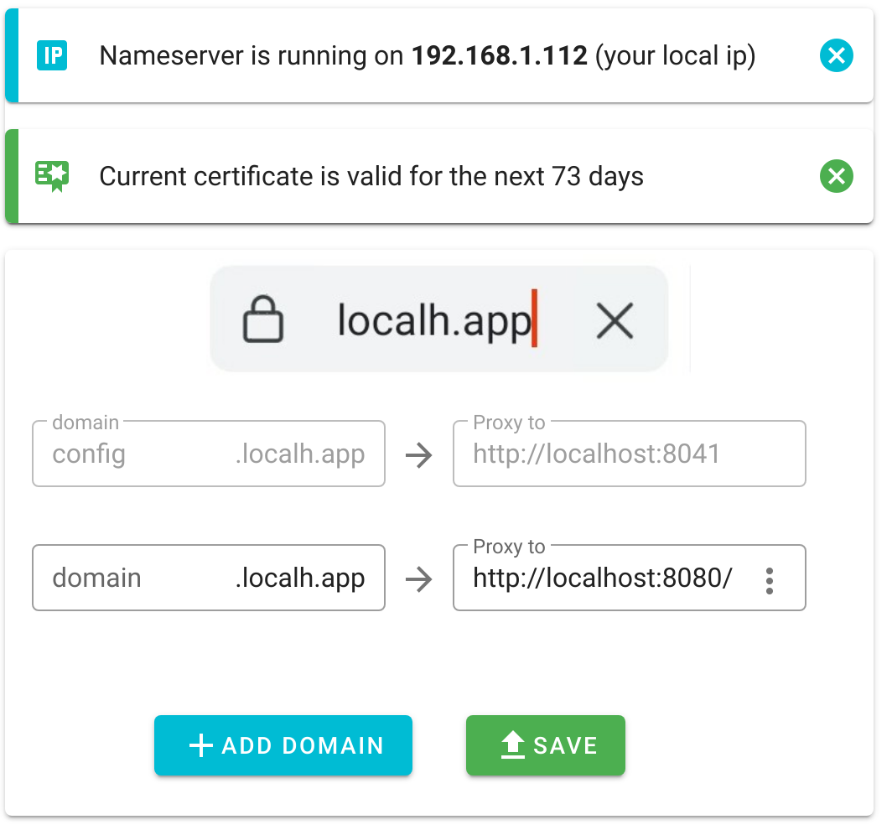

# What is this
This is a simple nodejs server. It can proxy your local traffic with a valid certificate from the localh.app or *.localh.app.
localh.app, localh.app and *.localh.app point to 127.0.0.1.

There is also an experimental nameserver, so you can connect from a mobile phone.

There is also a cli, if you only want to download the certificate.

# Server / Gui

### Install
```npm i @localhapp/server```

## Run
```localhapp```

A webpage where you can proxy *.localh.app to your localhost or other adresses.
There is also a small api available.



Please make sure that node is able to open port 80, 443 and 53.
See: https://gist.github.com/firstdoit/6389682

# Cli only

### Install 
You can dowload / update your certs with the command line
```npm i @localhapp/cli```

### Run
```localh-cli```


